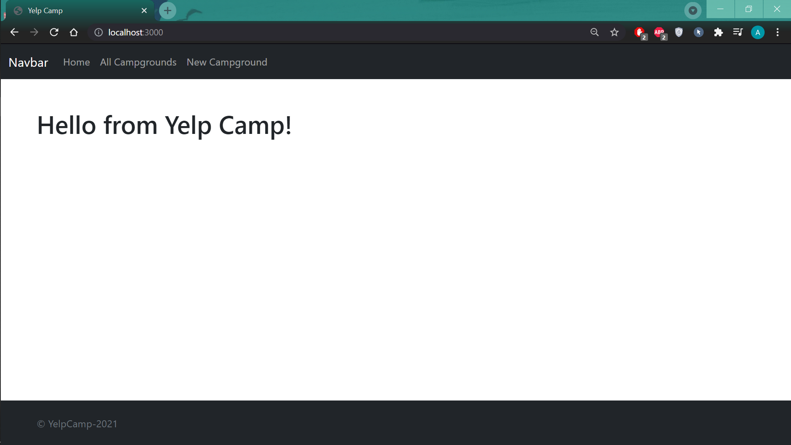
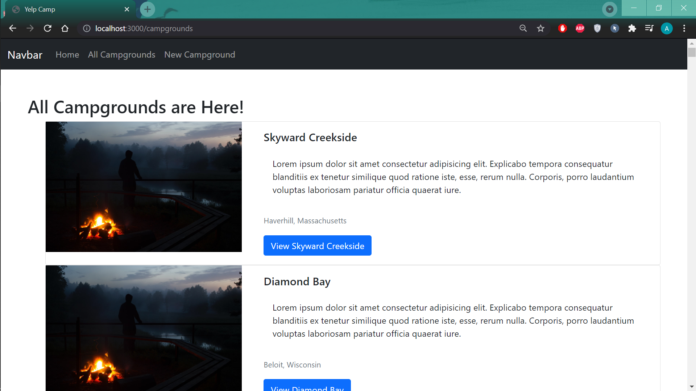
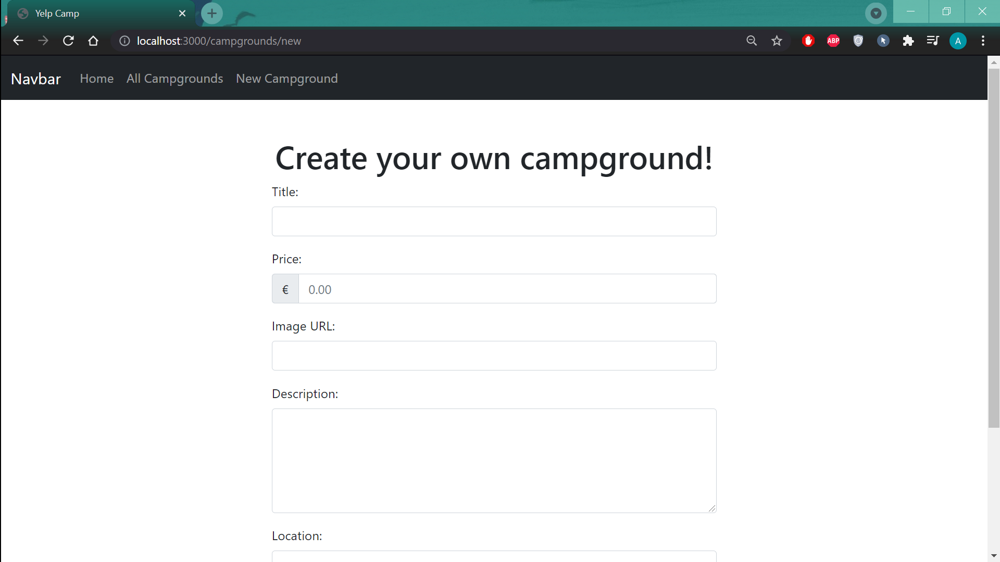
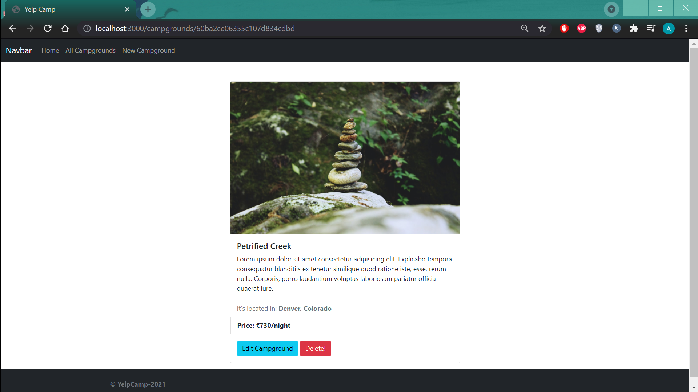

# yelp-camp
This contains the Basic CRUD functionality and basic styles for the website.  
The site is currently in development phase and cannot be viewed live.  
To replicate the above site, fork the repository, clone it in your desktop.  
Install all the dependencies in the pakage.JSON file.  
Start the Mongodemon shell and Gitbash. Use command 'node seeds/index.js' to seed the database  
Start the server with 'nodemon index.js' command in GitBash (You need to have node and express installed and have the mongodemon running)   
Go to web browser and open http://localhost:3000 to view the home page of 'yelp-camp'

I'm uploading some images to  show it how my website looks as of right now(9/6/21)

